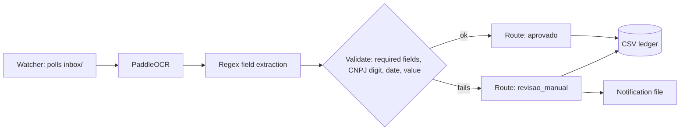

<div align="center">


[](https://github.com/vitormigli/invoice-ocr-automation/actions/workflows/ci.yml)


</div>

Automates an invoice-intake process: a folder watcher picks up invoice images,
runs them through PaddleOCR + rule-based field extraction, validates the result,
and routes each one to auto-approval or a human review queue — with every
decision logged and a notification written for anything that needs a person to
look at it. No LLM, no paid API, runs entirely on local CPU.

## Demo

```bash
docker compose up
```

Drop a `.png` invoice into `data/inbox/` — the `watcher` service picks it up,
moves it to `data/processed/`, appends the outcome to `data/ledger.csv`, and (if
it needed review) writes `data/notifications/<file>.json`. Or hit the API
directly at `http://localhost:8000/docs` (`POST /process`) for one-off processing.

## Architecture



## Results

Evaluated on synthetic invoices: half clean, half deliberately corrupted (missing
field, or blurred) to test whether routing correctly catches bad scans instead of
silently approving them. Full breakdown in
[`evals/results.md`](evals/results.md).

| Metric | Value |
|---|---|
| Field accuracy (clean docs) | 100.0% |
| Routing precision | 100.0% |
| Routing recall | 100.0% |

Perfect scores here are worth being skeptical of, not just reporting: all 9 corrupted
documents that got flagged were caught via "missing field" — the corruption strategy
that drops a field is, by construction, almost always going to be caught by the
"is this field present" check. None of this run's randomly-blurred-but-field-intact
cases happened to break OCR enough to matter. A harder, more honest test would corrupt
the image itself (heavier blur, skew, noise) while keeping every field textually
present, so extraction can genuinely fail rather than the field just being absent —
noted in Limitations rather than dressed up as a stronger result than it is.

## Technical decisions and trade-offs

- **Regex extraction, no LLM** — this project exists specifically as the
  classic-OCR contrast to
  [`doc-extraction-pipeline`](https://github.com/vitormigli/doc-extraction-pipeline)'s
  Claude-vision approach in this portfolio. Details in
  [`docs/decisions/0001-regex-over-doc-ai.md`](docs/decisions/0001-regex-over-doc-ai.md).
- **`enable_mkldnn=False` is hardcoded, not configurable** — the default oneDNN
  backend crashes at inference on this dev environment with a Paddle-internal
  error. Real bug, real workaround; see
  [`docs/decisions/0002-disable-mkldnn.md`](docs/decisions/0002-disable-mkldnn.md).
- **CSV ledger + JSON notification files instead of a database/message queue** —
  the automation pattern (watch → process → log → notify) is what's being
  demonstrated; the storage/notification backend is a swap-in detail once this
  runs against a real inbox (S3 + SQS + Slack webhook, e.g.).

## How to run

```bash
docker compose up
```

Or locally with [`uv`](https://docs.astral.sh/uv/):

```bash
uv sync
make test   # unit tests (extraction, routing, watcher — mocked OCR, no model download)
make eval   # downloads the PaddleOCR models once, then runs the eval
make run    # starts the on-demand API
make watch  # starts the folder-watching automation
make lint
```

## Limitations and next steps

- The eval's corruption strategy (drop a field's text entirely) makes the
  perfect routing score less impressive than it looks — see Results. A
  stronger eval would degrade the *image* (blur/skew/noise) while keeping
  every field's text present, so OCR itself can genuinely fail.
- Tuned to one invoice layout (see `generator.py`) — a real deployment would need
  either a more general extraction layer or per-vendor templates.
- No OCR confidence-score gating yet — routing only looks at whether required
  fields parsed and validated, not PaddleOCR's own per-line confidence, which
  would catch some "extracted something plausible-looking but wrong" cases the
  current rules miss.
- The `enable_mkldnn=False` workaround is specific to the dev environment this
  was built on — worth re-verifying on the actual deployment target.

## Resumo em português

Automatiza um processo de entrada de notas fiscais: um "watcher" de pasta pega
imagens de notas fiscais, roda OCR local (PaddleOCR) + extração de campos por
regex, valida o resultado (campos obrigatórios, dígito verificador do CNPJ, data,
valor) e decide entre aprovação automática ou fila de revisão humana — com log
de toda decisão e notificação para o que precisa de revisão. Sem LLM, sem API
paga, roda inteiramente em CPU local. Funciona como o contraponto de OCR clássico
ao `doc-extraction-pipeline` (que usa Claude vision) neste portfólio.
